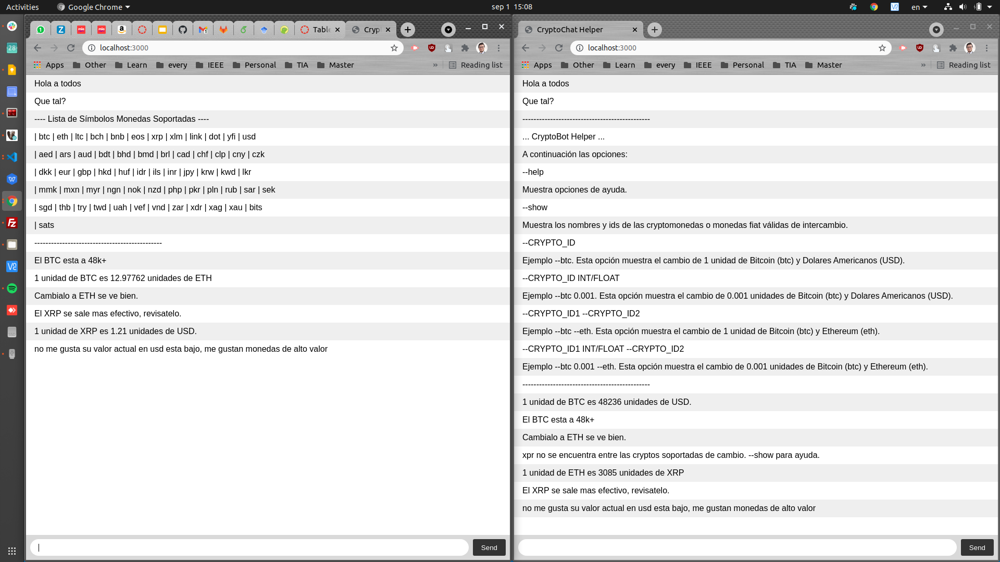

# NODE JS - CHAT

Primera etapa: Tutorial sobre chat con nodejs.

npm install express@4
npm install socket.io

# Segunda parte:

Agregar una interactividad clientes-Servidor.

Actividad: Un resolverdor de precios entre cryptomonedas




## Modo de uso

Cualquier cliente puede interactuar con el servidor y este unicamente respondera al cliente que lo solicito.


### prefijo

Para iniciar la conversacion con el servidor, cualquier cliente puede enviar una serie de argumentos (relacionados a cryptomonedas) precedidas de el prefijo '-crypto-', que alertara al servidor que se quiere realizar una interaccion que los otros usuarios no puedan ver.


### --help

Para ver las opciones se puede el siguiente mensaje: 


```
-crypto- --help
```

Este tendra la siguiente salida. donde se observaran todas las posibles comunicaciones con el servidor.


### --show

Todas las monedas pueden realizar intercambios solo a monedas soportadas (eso sucede pues algunos brokers prefieren que los usuarios manejen intercambios entre monedas mas populares). Para esto entonces se tiene un listado de monedas intercambiables que se puede visualizar con la ayuda del comando. Este mostrara los simbolos de todas las monedas que se puedan usar para intercambiar.

```
-crypto- --show
```


### --COIN_SYMBOL

Al utilizar este argumento se esta solicitando el cambio de 1 unidad de la moneda hacia dolares americanos. En el siguiente ejemplo se puede cambiar btc (simbolo de bitcoin) por cualquier otro como eth (ethereum), dot (polkadot), y muchos mas. 

Este primer argumento no esta limitado a las monedas de intercambio soportadas. Ejemplo, la segunda imagen utiliza el simbolo xrp (simbolo de moneda ripple), esta no se encuentra entre las soportadas pero si puedo visualizar su cambio entre esa moneda y cualquiera de las soportadas (en la imagen USD por dolares americanos).

```
-crypto- --btc
```


### --COIN_SYMBOL CANTIDAD

En algunas ocasiones se deseara poder hacer intercambio y ver cuanto sale una cantidad distinta a 1 unidad de aquella moneda. Para esto se puede hacer uso de un segundo argumento que sera un numero (puede ser decimal) que se utilizara como cantidad para hacer la conversion.

```
-crypto- --btc 9.26
``` 


### --COIN_SYMBOL --COIN_SYMBOL(SUPPORTED)

Es normal que no solo se quiera ver conversiones de una monea hacia USD (dolares americanos), por tanto con el comando siguiente se pueden cambios entre monedas de la plataforma hacia monedas soportadas unicamente. Ej XRP es una moneda dentro de la plataforma, pero no lista dentro de las soportadas de intercambio, por ende no puede ser usada como segundo coin_symbol. En este ejemplo se esta cambiando bitcoin a ethereum.

```
-crypto- --btc --eth
``` 


### --COIN_SYMBOL CANTIDAD --COIN_SYMBOL(SUPPORTED)

Similar a lo anterior mencionado, tambien se pueden hacer intercambio entre cualquier moneda de la plataforma hacia las monedas soportadas de intercambio y a su vez ya indicar una cantidad de la moneda que se quiere convertir. El siguiente comando puede ser utilziado para esto.

```
-crypto- --xrp 15 --eth
``` 


### Otros

Cualquier otro tipo de argumento o algun argumento mal indicado sera reportado por el servidor al cliente unicamente con algun mensaje especifico de su error.